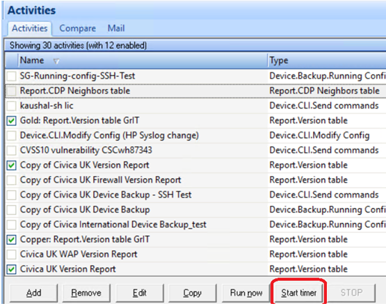

### Introduction

**Purpose:**

Kiwi CatTools is powerful and affordable NMS software for network automation and configuration. In Civica, network team (IN and UK) uses this tool for scheduling automated config backups for network devices.

**Scope**

Managing and maintaining the infrastructure of the CatTool is the responsibility of the Infrastructure Team - 4 (IT4). Whereas Service is to be manage by Network team. Infrastructure includes the virtual server CR-UK-NMGMT-7.coresvcs.local. IT4 team is also responsible to maintain the up to date version of the CatTools and patch the server. IT4 team is responsible to monitor the server 24x7 using Zabbix.

### Server Configuration

| Configuration | Description |
| -- | -- |
| HostName | CR-UK-NMGMT-7.coresvcs.local |
| IP Address | 10.44.113.99 |
| OS | Microsoft Windows Server 2016 Standard |
| Ram/CPU | 4.00 GB/Intel(R) Xeon(R) Gold 6230 CPU @ 2.10GHz, 2095 Mhz, (2 Processor) |
| Server Type | VMware Virtual Platform |
| Drives | C: (70 GB), E: (149 GB), F: (100 GB)

### CatTool Description

| CatTool | Description |
| -- | -- |
| Full name | Solarwind Kiwi CatTool |
| Version | 3.12.3.3443 |
| Edition | Enterprise |
| Customer ID | SW22452598 (This ID is for installation on the server CR-UK-NMGMT-7 only )
| Tech Support Email | technicalsupport@solarwinds.com |
| Website |  https://www.solarwinds.com/kiwi-cattools |

### CatTool License

| CatTool | Description |
| -- | -- |
| License Type | Commercial |
| Renewal Date | 14 Feb 2025 |
| Registered User | Glenn Wheeler (glenn.wheeler@civica.co.uk) |

### How to access CatTools

Log on to the server CR-UK-NMGMT-7.coresvcs.local using domain ID. On the desktop, you will find CatTools Manager shortcut. Double click to open the same.

OR 

To find the CatTools Manager exe, refer the below installation path. 
E:\Program Files (x86)\CatTools3

### Important Notes

1) Make sure that whenever closing the application we click “Start Timer” (as shown in below screenshot) and then close/exit the application window. This will help scheduler to run reports on time.

    

2) The folder listed below contains a configuration backup of the network devices. Over time, this folder eats free space. Any previous backup files can be erased after approval from the NOC team and make sure that a backup is available for this folder.

      E:\Program Files (x86)\CatTools3\Reports\ConfigChanges\CivicaUK

3) Daily backups of network devices are scheduled and executed. Therefore, prior authorisation from the NOC team would be required before the server shut down or restart.

### CatTool upgrade overview

1. Refer Preflight checklist given on the upgrade guide.
2. Make a full backup of your existing installation, including database. Also, take backup of Devices and ACtivities configured in the CaTools.
3. Uninstall the current version.
4. Download the latest installation file from the SolarWinds Customer Portal.
5. Run the Installation file. ( Make sure required .NET version is installed)
6. While installation, choose CatTools as a "Service" as we are using Enterprise edition.
7. Restore Database from the backup. (This will include Devices and Activies)
8. Consult NOC team to restore Configfiles from the installation folder backup.

For detail steps, refer below link.  
https://documentation.solarwinds.com/en/success_center/kct/content/kct_upgrade_guide.htm

### Customer Support and License management

1. Browse the portal https://customerportal.solarwinds.com/login  
2. Login using registered Email Id only and configured password. From the IT4 team, currently registered email ID is ajay.pipaliya@civica2.com. For password, Please contact the same. (Registered ID is with NOC IN team as well). In case new user to be register, Please contact glenn.wheeler@civica.co.uk
3. Click on the tab "Technical Support" and choose option "Open a support case".
4. For License management, click on the tab "License".
5. You can also download available latest version, Hotfixes, Release Notes and technical documents of the tool using the same login.
6. Technical Support Email ID: technicalsupport@solarwinds.com
7. Telephone:  
(Americas): +1-866-530-8040, option 3 or +1-512-682-9300  
(EMEA): +353 21 5002900  
(DACH): +49 30 390 634 50  
(APAC): +65 6593 7600  
