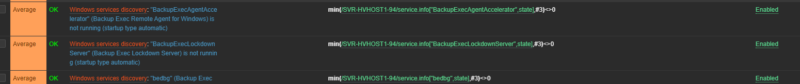

### Introduction

   **Purpose:**

   The purpose of the backup solution is to ensure the secure and reliable preservation of critical data. This process is designed to protect against data loss due to accidental deletion, hardware failure, corruption, or other unforeseen issues by creating copies of essential files and storing them in a designated backup location.

   **Scope:**

   Backup procedure is applicable to important operational servers available at Notus site
   
   The IT infrastructure - 4 team is taking care of backups which is based on tape solution in which data is copied to an LTO-7 tape using a HPE MSL2024 Tape Library with 1 Tape Drive. The backup software currently in use is Veritas Backup Exec 22.0 Rev. 1193 (64 bit). The backup process contains options for both full and incremental backups depending on the defined schedule and requirements.

   In addition to that in case of disaster recovery situation same backup set is configured over resilience DC site in Mumbai (MUDC).

## Architecture Overview:

### _Hardware Components:_

| Type | Model | Hostname | Service Tag | Location |
| -- | -- | -- | -- | -- |
| Hyper-V Host | HPE DL380 Gen10 | SVR-HVHOST5-94 | SGH834T8K3 | Notus |
| Tape Library| HPE MSL2024 Tape Library | TAPELIB-94| DEC14607HY | Notus |
| Hyper-V Host | HPE DL380 Gen10 | SVR-HVHOST1-95 | SGH103SL6Q | MUDC |
| Tape Library| HPE MSL2024 Tape Library | TAPELIB-95| DEC0250720 | MUDC |

Note: SVR-HVHOST5-94 and SVR-HVHOST1-95 are console of Backup Exec tool.

### _Backup Clients:_

| Type | Hostname | Location | Data Selection | Description |
| -- | -- | -- | -- | -- |
| Hyper-V Host | SVR-HVHOST5-94 | Notus | C:, EFI System Partition, System State| Hyper-V host and Backup Management Server ||
| Hyper-V Host | SVR-HVHOST1-94 | Notus | F: | Hyper-V host and virtual machine disk backups |
| Virtual Machine | SVR-TALLY-94.Civica2.local | Notus | C:, F:, G:, EFI System Partition, System State| Account Server |
| Virtual Machine | SVR-File-94.Civica2.local | Notus | C:, F:, EFI System Partition, System State | File Server |
| Virtual Machine | SVR-NMGMT-94. Civica2.local | Notus | C:, D:, System State | Management server for network |

### _Data location and Tapes:_

The data is being backed up in LTO Tapes and the Tapes are stored in Tape Library devices at respective locations. i.e. Notus, Vadodara and MUDC, Mumbai site. 

### _Backup Management Console:_

Management console is installed on the server SVR-HVHOST5-94 at Notus site and SVR-HVHOST1-95 at MUDC site. Console can be accessible from the shortcut created on the desktop of the respective servers.

### _Backup Schedule:_

| Notus Backup frequency | Start Time (in IST) | Backup Type | Retention Period |
| -- | -- | -- | -- |
| Daily (Monday to Thursday) | 10:00 PM | Incremental Backup | 1 Week |   
| Weekly (Saturday)	| 06:00 AM | Full Backup | 4 Week |
| Monthly (Last Saturday of month) | 10:00 PM |	Full Backup |	4 Months
| Yearly (Fourth Saturday of December) | 10:00 PM |	Full backup |	10 Years

| NMUDC Backup frequency | Start Time (in IST) | Backup Type | Retention Period |
| -- | -- | -- | -- |
| Daily (Monday to Thursday) | 04:00 AM | Incremental Backup | 1 Week |   
| Weekly (Friday)	| 04:00 AM | Full Backup | 4 Week |
| Monthly (Last Saturday of month) | 04:00 AM |	Full Backup |	4 Months
| Yearly (Last Thursday of December) | 04:00 AM |	Full backup |	10 Years

## Monitoring and Alerts:

Backup management server is being monitored by Zabbix tool. Backup Exec software services are also being monitored by Zabbix tool and under the template called “Windows by Zabbix agent”

IT Infrastructure – 4 team also receives backup status (Start/Successful/Failed/Cancel) notification every day To email INTechCentreMonitoring@civica2.com.
From the email notusbackupexec@civica2.com and mudcbackup@civica2.com 

## Tape Rotation Scheme:

The tape rotation scheme used is a grandfather-father-son. The basic method is to define three sets of backups, such as daily (son), weekly (father) and monthly (grandfather). 
There are 4 daily tapes (Day 1 – Day 4) each used once every week Monday to Thursday.
There are 4 weekly tapes (Week 1 – Week 4) each used once every 4 weeks on a Friday.
There are 4 monthly tapes (Month 1 – Month 4), one being used every 4 months on the Last Saturday of the month.

There is 1 yearly tape (Year), one being used every year on the Last Sunday of the year.
In addition, to that in case of disaster recovery situation same backup set is configured over resilience DC site in Mumbai (MUDC).

## About Backup Exec tool:

Backup Exec application is purchased from the vendor Veritas Technologies LLC. Any details about purchasing, Admin team can be contacted. Currently installed Backup Exec version is 22.0 Rev. 1193 (64-bit) at both the location. In case of any technical help, Veritas can be contacted.

Below are the important services related to Backup Exec and must be in the state of “Running” to execute the backup jobs.

You can Start/Stop/Restart the above services from Backup Exec console.
Note: In case these services are in “Stop” state, Backup Exec console will not run.
Using the Windows Services Manager (services.msc) or any other services manager, stop the Backup Exec Services in the following order: 

Backup Exec Job Engine                                                     
Backup Exec Management Service  
Backup Exec Agent Browser  
Backup Exec Server  
Backup Exec Device & Media Service   
Backup Exec Device & Media Service  
Backup Exec Remote Agent for Windows  
Backup Exec Error Recording Service  

In order to start the services, reverse the order of the above list.

For technical support, log case with Veritas using below URL:

https://www.veritas.com/content/support/en_US

Sign in with Email ID: INTechCentreMonitoring@civica2.com and password can be opted from the Civica managed Keepass Level1.

## System Logon Accounts:

To log on to the Backup servers, Administrator must use domain ID of Civica2.local domain. Once you logged on to the server, you can access Backup Exec tool by clicking on the icon available on the desktop. However, to Edit the settings of Backup Exec, you need to provide credentials of service account named “civica2\svr.backup” and password can be opted from the Civica managed Keepass Level2.

## Tape Library:

Civica India has two Tape Library available at Notus, Vadodara and DR site MUDC, Mumbai. The same version of Tape Library is available with a single Tape Drive.

| Location | Make | Library Name | Serial Number | IP |
| -- | -- | -- | -- | -- |
| Mumbai MUDC | HPE StoreEver MSL2024 Tape Library | TAPELIB-95 | DEC0250720 | http://10.91.79.19 |
| Vadodara | HPE StoreEver MSL2024 Tape Library | TAPELIB-94 | DEC14607HY | http://10.91.102.64 |

For technical support, log case with Veritas using below URL:

https://support.hpe.com/hpesc/public/home/signin

Sign in with Email ID: INTechCentreMonitoring@civica2.com and password can be opted from the Civica managed Keepass Level1

