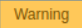
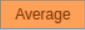
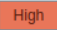
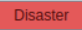

### Monitoring

Systems are monitored by Zabbix

Zabbix can be accessed via [http://svr-zabbix-7.civica.root.local/zabbix/](http://svr-zabbix-7.civica.root.local/zabbix/)

1. "Dashboard" view gives you an overview of any issues. Monitoring > Dashboard > "Dashboard" 

2. All issue, covering servers, devices, or services being monitored in Zabbix will be shown here

3. Upto 15 minutes should pass to see if the issue resolves itself. Once 15 Minutes have passed, and the issue is still showing, a case should be raised via [Employee Service Cloud Analyst console](https://civicainternal.lightning.force.com/) according to priority table mentioned below.

| Severity | Color | Priority |
| ----------- | ----------- | ----------- |
|  | Yellow | P4 |
| | Orange | P3 |
|  | Light red | P2 | 
|  | Red | P2 |
| Multiple Disaster | Red | P1 |

4. Please refer below guide as to which alerts we need to monitor.

      ### What to monitor: 

      | **India Servers, Devices, and Services:** |
      | ------------------------------------------|  
      | Alerts with categories: **Warning, Average, High, Disaster** |

      | **HRP Servers and Services:** |
      | ------------------------------------------|  
      | Alerts with categories: **Warning, Average, High, Disaster** |

      | **All Other Servers, Devices, and Services:** |
      |-----------------------------------------------|
      | Alerts with categories: **High, Disaster** |

5. Acknowledge the issues in Zabbix, referencing the Service Cloud Case Number in Message box and tick Acknowledge check box.

6. The IT4 team will make every effort to troubleshoot and resolve the case independently. If additional support is required, Assistance will be obtained from the ownering system team.

7. Triage the case in [Employee Service Cloud Analyst console](https://civicainternal.lightning.force.com/) as per below mentioned process, if IT4 are not able to resolve it. 

    ### Alert Triage Process:   

      | **Network-Related Alerts:** |
      | ------------------------------------------|  
      | Should goes to: **Infrastructure - NOC** |

      | **ILO/Hardware-Related Alerts:** |
      | ------------------------------------------|  
      | Should goes to: **ITS - Helpdesk Triage** |

      | **Server and Service-Related Alerts:** |
      |-----------------------------------------------|
      | Should goes to: **IT1-IT5** |

8. During Out of Hours (OOH), The IT Systems team are available 24x7 providing out of hours support to colleagues based in the UK, Australia, Singapore, Canada and the US (Out of Hours is currently unavailable in India), you can reach out to our out of hours function in the event of a priority 1 issue that has a business-critical impact.

**Contact information for each region can be found below:**

| Region | Contact Number |
| -------- | ------------- |
| Canada | +14316311961 |
| UK | +44113 2010880 |
| Australia | +611300164214 |
| Singapore | +6560310040 |
| US | +19379988600 |

