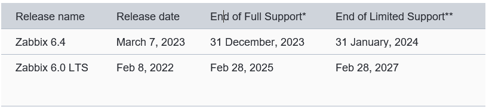
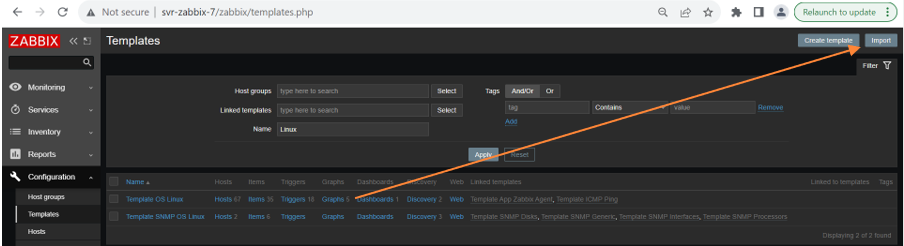

### Introduction

Zabbix is an enterprise-class open-source distributed monitoring solution.
Zabbix is a software that monitors numerous parameters of a network and the health and integrity of servers, virtual machines, applications, services, databases, websites, the cloud and more. Zabbix uses a flexible notification mechanism that allows users to configure email based alerts for virtually any event. This allows a fast reaction to server problems. Zabbix offers excellent reporting and data visualization features based on the stored data. This makes Zabbix ideal for capacity planning.
Zabbix supports both polling and trapping. All Zabbix reports and statistics, as well as configuration parameters, are accessed through a web-based frontend. A web-based frontend ensures that the status of your network and the health of your servers can be assessed from any location. Properly configured, Zabbix can play an important role in monitoring IT infrastructure. This is equally true for small organizations with a few servers and for large companies with a multitude of servers.
Zabbix is free of cost. Zabbix is written and distributed under the GPL General Public License version 2. It means that its source code is freely distributed and available for the general public.
We currently use Zabbix to monitor Windows, Linux, HAProxies, switches, routers, firewalls, SANs and websites. 
We currently do not have any support with the vendor. Zabbix is supported by IT4 team, As IT4 team don’t have access of VI-19 console so for Zabbix server related issue also for Zabbix-6 proxy need to involve IT1/2/3 team. day to day monitoring is completed by IT4 team. 
We currently have support until 28/02/2025. 

**Zabbix Release Lifecycle Policy:**

## How Zabbix works:

**Server Proxy deployment:**

We have a Server-Proxy deployment which is where we have a server which supports the main Zabbix functions with a proxy in each region to monitor the hosts in that region. 
Each proxy will send data to the Zabbix Server which will update the MySQL database, the proxies hold the data for a little amount of time. 
The proxies are configured within both the configuration files on the proxy as well as the Zabbix frontend (http://svr-zabbix-7.coresvcs.local/zabbix/zabbix.php?action=proxy.list)
We can also monitor the queue of checks being completed by viewing the ‘Queue overview by proxy’ page (http://svr-zabbix-7.coresvcs.local/zabbix/zabbix.php?action=queue.overview.proxy)

**Monitoring and alerts:**

We generate data and alerts by using a mixture of methods this could be via HTTP requests to the HAProxy’s stat’s page or we can use Zabbix Agents. 
We can gather the data which is called an ‘item’ which then can be used to create a ‘trigger’ which will generate an alert which criticality can be configured; this is normally populated by the templates however this can be configured on a case-by-case basis. 

**Host configuration:**

For most of our monitoring, it is using ‘Zabbix Agents’ which are configured on the operating system of the host which you are trying to monitor then we apply template to that host in Zabbix which populate the items and triggers which is required so we can respond to alerts.
To use Agents, we must use the same name in Zabbix as we do in the configuration file, and it must have the IP address configured in the host. We may need to add variables in the ‘Marco’ tab in the host configuration depending on what need to configure. 
We generally use templates to configure the monitoring, and this must be linked to the host or the host group to apply to generate the items and triggers. 
We may need to create items and triggers ourselves if we are trying to create monitoring for something outside of the templates – this will require reading the Zabbix documentation which is linked in the appendix. 
Zabbix provides plenty of documentation on how this can be achieved and if you are unsure, please refer to the documentation or raise a ticket in CSD.

**Templates:**

We can apply templates to both hosts and host groups, host groups are a collection of hosts which should share a common feature you would like to monitor i.e by application or by operating system type. 
Templates allow for a uniform and consistent monitoring of certain aspects of a host for example disk utilisation, services running, load balancer pools being down etc. 
Zabbix being an open-source product a lot of templates are created and provided by the community with varying quality and methods of configuration so it’s best to review and analyse the template before adding to the host/host groups to know what is going to be recorded and most importantly what triggers will be created which our colleagues will respond to. 

### Zabbix OS Setups

A complete list of all servers in the Zabbix infrastructure is available further down in the documentation. 
Access to the servers is managed by Active Directory security groups either ‘International-ZabbixAdmins’ or ‘International-LinuxAdmins’ which should provide full SSH / root access. 

**Zabbix Server:**

The Zabbix server is SVR-ZABBIX-7, Zabbix 6.0 LTS is installed running on Ubuntu 22.04. The VM is hosted in the Luton ONI VI19 datacentre. As IT4 team don’t have access of VI19 IT1/2/3 need to manage the Zabbix server. If due to some issue if Zabbix server not accessible using SSH then IT1/2/3 team need to check the same by VI-19 console.
The database is MySQL using the ‘zabbix’ database and it’s using Apache/PHP for it’s Web frontend. 
The OS storage is setup in an LVM setup, there’s two LVs one for the OS/Software installed /dev/svr-zabbix1-7-vg/root and another for the swap /dev/svr-zabbix1-7-vg/swap_1. The VG for the two LVs are svr-zabbix1-7-vg. All disk expansions need to have another disk adding to it.
We have made several changes to the default setup for Zabbix such increasing timeouts and changes variables in zabbix_server.conf to fine tune the performance. 
Another important consideration is the MySQL partitioning which should be creating new partition every 28 days dropping the oldest partition this will stop the database growing exponentially. The mysql_zbx_part.pl is ran daily as a cron job. To manage the Zabbix server OS you’ll need to use SSH to connect, using your coresvcs account however failing that you can use the sdpadmin account in KeePass. 

**The main configuration files for Zabbix server are:**

- `/etc/zabbix/zabbix_server.conf`
- `/etc/mysql/my.cnf`
- `/etc/apache2/conf-available/zabbix.conf`
- `/usr/share/zabbix/mysql_zbx_part.pl`

**The Zabbix Server is backed up using Commvault.**  
This can be restored by the Internal infrastructure and Service Centre; however, consult the IT1/2/3 team before proceeding with a restore.

**Zabbix Proxy:**

 
Each region has a Zabbix Proxy, the name convention is CR-COUNTRYCODE-ZABPXY-SITEID for example ‘CR-UK-ZABPXY-6’. 
Each Zabbix Proxy is running Zabbix-Proxy and MySQL on Ubuntu either 20.04 or 22.04. The servers can be rebooted without any impact to the main Zabbix server other than monitoring to the site it’s within. 
Zabbix being used across Civica, we have both different hosting methods for the VMs, this is generally either Hyper-V or vSphere so we are required to configure them differently as they are two distinct technologies, I’d recommend following best practice for deployment this could be using generation 2 VMs for Hyper-V or installing VMware tools if hosted in vSphere. 
In the current version of Zabbix, it must be in the same release as the main Zabbix server (SVR-ZABBIX-7) however in later versions this will no longer be the case and they can operate in different versions allowing for an easier upgrade path. 
In case of a failure of the quickest way to recover the server is to built a new server using the same IP as the failed server, once networking has been configured you can proceed with running the Zabbix proxy script in http://resource.admin.coresvcs.local/zabbix/.
We may need to add scripts for certain checks – these scripts will need to be added into ‘/usr/share/zabbix/externalscripts’ and will need to be given the permissions to be an executable using the following command ‘sudo chmod +x filename.pl’. 

**MySQL:**

MySQL is a free and open-source database, we are currently using MySQL for our databases across the servers and proxies. 
Initially the MySQL database is configured using the ‘zabbix-sql-scripts’ which imports the database schema. The configuration of the databases is standardised across the proxies.
For Zabbix Server the tables are partitioned every day and will drop the partition every 60 days.

### Procedures

**Frontend :**

You can sign into the frontend using the following link http://svr-zabbix-7.coresvcs.local/zabbix/zabbix.php?action=dashboard.list. These accounts are local accounts within the Zabbix application – the passwords are encrypted in the MySQL database. 
New accounts need to be raised by a ticket in salesforce which will be picked up by the IT4 team to action. 

We can add new accounts by going to http://svr-zabbix-7.coresvcs.local.coresvcs.local/zabbix/zabbix.php?action=user.list and go to ‘create user’ in the right hand corner then providing the relevant details and user groups and roles as needed. 

**We have three main user groups:**

- `Civica Read Only `
- `Vadodara Team`
- `Zabbix administrators`

**We have three main user roles:**

- `User role`
- `Admin role`
- `Super Admin role`

Importing templates can be achieved by going to http://svr-zabbix-7.coresvcs.local/zabbix/templates.php and selecting ‘Import’ in the right hand corner. 

We can add a host by going to http://svr-zabbix-7.coresvcs.local/zabbix/zabbix.php?action=host.list and select ‘Create host’ in the right corner then filling out the relevant details like name, ip address, proxy which it needs to be monitored by and adding to the correct host groups. 

**Maintenance periods (Alert downtime):**

For adding maintenance periods, we should be navigating to the Configuration > Maintenance then searching for an existing window like the ‘Coresvcs Patching (SG)’ and editing the Active Since, Active Till and Period options to fit our implementation window or creating a new window. 
We should be deleting any ad hoc maintenance windows to lessen the amount of expired windows left in the view. 

**We have three main user roles:**

- `Coresvcs Patching (AU)`
- `Coresvcs Patching (IN)`
- `Coresvcs Patching (UK)`
- `Coresvcs Patching (SG)`
- `Coresvcs Patching (CA)`
- `Coresvcs Patching (US)`

**Backend  :**

The backend of the Zabbix Server and Zabbix Proxies are Ubuntu, MySQL and Apache (Server only).
The software versions are provided in the Zabbix installation so versions and dependencies of Zabbix should not be updated independently of Zabbix. 
As described in the ‘Zabbix OS Setups’ section there’s configuration files which may need to be updated when making changes to Zabbix, this should be done in a controlled method with backups of the configuration and snapshots in VMware or checkpoints in Hyper-v. 

**You can take a backup of a file within guest OS by using the following command:** 

- `sudo cp /etc/zabbix/zabbix_server.conf /etc/zabbix/zabbix_server.conf-bkp`

**You can restore the backup by running the following command:**

- `sudo cp /etc/zabbix/zabbix_server.conf-bkp /etc/zabbix/zabbix_server.conf`

With any change of the configuration files, you’ll need to restart the services, this can be done by running sudo service NAME restart then followed by sudo service NAME status.
To manage MySQL, you’ll need to run ‘sudo mysql’ command to enter the MySQL environment which from here you can manage the databases.  Anything within MySQL should be taken with precaution as it might lead to data loss. 
We have configured the binlogs to expire in 24 hours on each proxy to prevent any unrequired disk space being taken up as we can easily rebuilt these servers. 
For updating the servers, you can run ‘sudo apt-get update && apt-get upgrade’ this will update the packages and OS. We currently do not have a scheduled task for this however this may change. 
Each upgrade of Zabbix will need to be done within a RFC to full risk access any potential impact to the service. 
We may run out of disk space on the proxies, to resolve this issue we can run the housekeeping script from http://resource.admin.coresvcs.local/ubuntu/Housekeeping/Disk-Housekeeping.sh and run

**The commands are:**

- `sudo wget http://resource.admin.coresvcs.local/ubuntu/Housekeeping/Disk-Housekeeping.sh`
- `sudo chmod +x Disk-Housekeeping.sh`
- `sudo ./Disk-Housekeeping.sh`

**If the disk space runs out you’ll need to add a new disk and follow these commands commands to expand the Volume Group:**

- `sudo fdisk -l`
- `sudo rescan-scsi-bus`
- `sudo fdisk -l`
- `sudo pvcreate /dev/sdv (replace sdv with the new hard drive)`
- `sudo vgextend svr-zabbix1-7-vg /dev/sdv (replace sdv with the new hard drive)`
- `sudo lvm lvextend -l +100%FREE /dev/svr-zabbix1-7-vg/root`
- `sudo resize2fs -p /dev/mapper/svr--zabbix1--7--vg-root`

### Troubleshooting

**Windows Servers:**

There are a few common issues, mainly due to configuration issues during setup. The configuration file will need to be configured to point to the correct proxy and the has the same host name in Zabbix as it should be on the configuration file. 

We need to make sure the service is running, we can check this using services.msc or PowerShell by issuing ‘Get-Service “Zabbix-Agent”’. 
We can change the debug so we can get more information in the Zabbix log, by changing the ‘debug level=0’ value to whichever variable you believe is required, this will log events into C:\Program Files\Zabbix Agent\zabbix_agentd.

After any change to the configuration file, you will need to restart the Zabbix service. 

**File Location:**
 - `•	C:\Program Files\Zabbix Agent\zabbix_agentd.conf`

You can check communication from the Windows server to the Proxy by using the tnc command in Powershell ‘tnc 10.44.113.56 -port 10050’.

### Linux Servers

There are a few common issues, mainly due to configuration issues during setup. The configuration file will need to be configured to point to the correct proxy and the has the same host name in Zabbix as it should be on the configuration file. 
You can edit the file by using ‘sudo nano /etc/zabbix/zabbix_agentd.conf’ and then restarting the service.You can restart the service by running ‘sudo service zabbix-agent restart’ which will restart the service and apply any new configuration from the configure file. 

**File Locations:**

- `/etc/zabbix/zabbix_agentd.conf`
- `/var/zabbix/zabbix_agentd.log`

**Reviewing log files on Server and Proxies:**

Whilst troubleshooting issues, you may need to review the log files this can be done a few different ways. 
If we take the Zabbix Server’s zabbix_server.log for example, we simply just run ‘cat zabbix_server.log’ which will display the log file in its entirety however we will probably want to manipulate the output to show only what we are looking for so we can run ‘cat zabbix_server.log | grep -i cr-uk-zabpxy-3’ to only see the entries relating to ‘cr-uk-zabpxy-3’. 
We can also use tail to see the log as it updates live and like cat, we can use the grep command to filter for only what we require to see. 

**Command examples:**

- `less zabbix_server.log`
- `less zabbix_server.log | grep -i 'cr-uk-zabpxy3'`
- `tail -f zabbix_server.log | grep 'cr-uk-zabpxy-3'`

**Log locations:**

- `/var/log`
- `/var/log/mysql`
- `/var/log/zabbix-server`
- `/var/log/zabbix-proxy`

There’s also dmesg and journalctl to review OS related logs. 

### Current servers in the Server-Proxy Setup

| Hostname | Function | 
| -- | -- | 
| SVR-ZABBIX-7 | Zabbix Server| 
|CR-AU-ZABPXY-65 | Zabbix Proxy | 
|CR-AU-ZABPXY-67| Zabbix Proxy | 
| CR-CA-ZABPXY-85| Zabbix Proxy| 
| CR-IN-ZABPXY-94| Zabbix Proxy | 
|CR-IN-ZABPXY-95| Zabbix Proxy | 
|CR-IN-ZABPXY-91| Zabbix Proxy|
|CR-UK-ZABPXY-1 | Zabbix Proxy | 
|CR-UK-ZABPXY-2| Zabbix Proxy | 
|CR-UK-ZABPXY-3| Zabbix Proxy|
|CR-UK-ZABPXY-4 | Zabbix Proxy | 
|CR-UK-ZABPXY-6| Zabbix Proxy | 
|CR-UK-ZABPXY-16| Zabbix Proxy|
|CR-UK-ZABPXY-18| Zabbix Proxy | 
|CR-UK-ZABPXY-28| Zabbix Proxy | 
|CR-UK-ZABPXY-36| Zabbix Proxy|
|CR-UK-ZABPXY-38| Zabbix Proxy | 
|CR-UK-ZABPXY-41| Zabbix Proxy | 
|CR-UK-ZABPXY-46| Zabbix Proxy|
|CR-UK-ZABPXY-2-1 | Zabbix Proxy | 
|CR-US-ZABPXY-81| Zabbix Proxy | 

Note: CR-UK-ZABPXY-28: This proxy is related to IPLBATH domain and IT4 team don’t have access of it. IT4 team not able to access the same.

SVR-ZABBIX-7: Its main Zabbix server and hosted on VI-19. IT4 team don’t have access of VI-19. So, if IT4 team not able to access the server then IT4 team need assistance from the IT1/2/3.

CR-UK-ZABPXY-6: This proxy hosted on the mansdpmvcs01a.hosting.civica.com domain and IT4 team don’t have access of it. So, if IT4 team not able to access the server then IT4 team need assistance from the IT1/2/3.

### RPO and RTO

**Zabbix Server:**

If in case, we need to rebuild the Zabbix Server(svr-zabbix-7). Backup has been configured in the VI-19 CommVault. As we don’t have access of VI-19. Need assistance from the IT1/2/3 team. For the Zabbix server its take approx. time (12 to 18 hours) for the restore.

**Zabbix Proxy:**

If in case, we need to rebuild the proxy server then we can rebuild the same with below script.
Once OS is installed and configured all necessary network setting and IP. once networking has been configured you can proceed with running the Zabbix proxy script in http://resource.admin.coresvcs.local/zabbix/.
We may need to add scripts for certain checks – these scripts will need to be added into ‘/usr/share/zabbix/externalscripts’ and will need to be given the permissions to be an executable using the following command ‘sudo chmod +x filename.pl’. 
You can rebuild the proxy server within 1 Hr. 

http://resource.admin.coresvcs.local/zabbix/.
 is hosted on CR-UK-MGMT-6.coresvcs.local and path of scripts are E:\Websites\Resource\zabbix

### Appendix

https://www.zabbix.com/documentation/6.0/en/manual/introduction
https://zabbix.com/life_cycle_and_release_policy
https://wiki.ubuntu.com/Lvm
http://resource.admin.coresvcs.local/zabbix/
https://manpages.ubuntu.com/manpages/xenial/en/man1/dmesg.1.html
https://manpages.ubuntu.com/manpages/jammy/en/man1/journalctl.1.html
https://www.zabbix.com/integrations

